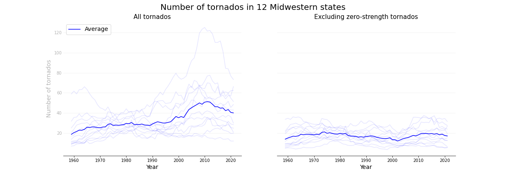
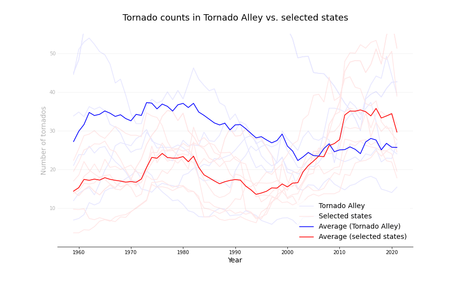

# Is There Evidence of Climate Change in the US Tornado Statistics?

I came upon two National Geographic online educational articles that discuss the impacts of climate change on tornadoes in the US and make claims on trends in tornado statistics ([_Tornadoes and Climate Change_](https://education.nationalgeographic.org/resource/tornadoes-and-climate-change) and [_Tornadoes and Global Warming: Is There a Connection?_](https://education.nationalgeographic.org/resource/tornadoes-and-global-warming-there-connection)).  So, I decided to try to get tornado data, visualize them, and validate some of the claims made in those articles.

## Data exploration and cleaning

For this purpose, I will use the data from [Storm Events Database](https://www.ncdc.noaa.gov/stormevents/) (by the National Centers of Environmental Information).  Using the pandas, BeautifulSoup, and requests modules in Python, I downloaded all the data files containing anunual storm statistics and extracted the tornado data ([data_collection.ipynb](data_collection.ipynb)).  Then, I did an initial exploration and cleaned the data ([data_cleaning.ipynb](data_cleaning.ipynb)).  In particular, I had to handle missing information on tornado strengths.  Using the cleaned data, I examined the validity of specific claims from the National Geographic articles.

## No long-term increase in tornado frequency

In [_Tornadoes and Climate Change_](https://education.nationalgeographic.org/resource/tornadoes-and-climate-change), they say that "... when you remove small tornadoes from the record, the data does not suggest any long-term increase in tornado frequency."  In [_Tornadoes and Global Warming: Is There a Connection?_](https://education.nationalgeographic.org/resource/tornadoes-and-global-warming-there-connection), they say, "... a closer look at the data shows the increase is only in the weakest category, EF0. There's been no increase in stronger twisters, and maybe even a slight decrease in EF4s and EF5s."  While I observed an inreasing trend in the number of tornadoes in midwestern states in [an assignment](Coursera_Assignment_4_Nishikawa.pdf) for the Coursera course [_Applied Plotting, Charting & Data Representation in Python_](https://www.coursera.org/learn/python-plotting?), the trend disappeared when I filtered out all tornadoes records with strength 0, as you can see in the figure below (see [Jupyter notebook](/analysis_midwestern.ipynb) for more detail).

## Number of tornado days

"Research has shown that there are fewer days with at least one tornado but more days with over thirty, even as the total number of tornadoes per year has remained relatively stable." (from [_Tornadoes and Climate Change_](https://education.nationalgeographic.org/resource/tornadoes-and-climate-change))

## Up and down trends in Tornado Alley

"The number of tornadoes in the states that make up [Tornado Alley](https://en.wikipedia.org/wiki/Tornado_Alley) are falling, while tornado events have been on the rise in the states of Mississippi, Alabama, Arkansas, Missouri, Illinois, Indiana, Tennessee, and Kentucky." (from [_Tornadoes and Climate Change_](https://education.nationalgeographic.org/resource/tornadoes-and-climate-change))

